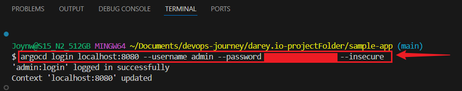
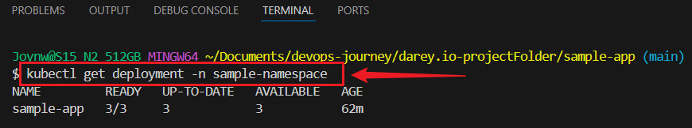

# GitOps Application Deployment with ArgoCD

## This project demonstrates a complete GitOps workflow using **ArgoCD** to deploy and manage a sample Kubernetes application from a Git repository.


## Overview

In this project, I

- Define Kubernetes applications in YAML.
- Deploy them using **ArgoCD**.
- Manage application lifecycle: sync, rollback, monitor health.
- Follow best practices for Git repository structure.


## Project Structure

```bash
sample-app/
├── dev/
│ └── deployment.yaml # Deployment for the dev environment
├── prod/
│ └── deployment.yaml # Deployment for the prod environment
├── k8s/
│ └── deployment.yaml # Main manifest ArgoCD reads from
├── app-definition.yaml # ArgoCD application configuration
└── src/
```


##  Prerequisites
Ensure you have:
- A Kubernetes cluster (Minikube, kind, etc.)
- `kubectl` installed and configured
- ArgoCD installed in your cluster
- `argocd` CLI installed
- A GitHub repo containing this project


## Verify Installed Tools
```bash
git --version
docker --version
minikube start --driver=docker
kubectl version --client
argocd version --client
```


## 1: Set Up Minikube and ArgoCD
- Start Minikube:
```bash
minikube start --driver=docker
```

### Install ArgoCD in Minikube:
- Create a namespace for ArgoCD
```bash
kubectl create namespace argocd
```

### Install ArgoCD:
```bash
kubectl apply -n argocd -f https://raw.githubusercontent.com/argoproj/argo-cd/stable/manifests/install.yaml
```


### Check If Pod is Running
```bash
kubectl get pods -n argocd
```


### Access ArgoCD Web UI:
- Forward the ArgoCD web page:
```bash
kubectl port-forward svc/argocd-server -n argocd 8080:443
```

- Open `https://localhost:8080` on browser.

- Get the password:
      ```bash
      kubectl -n argocd get secret argocd-initial-admin-secret -o jsonpath="{.data.password}" | base64 -d
      ```
 - Log in with username `admin` and the password.


## 2: Create a Git Repository

- Create a GitHub Repository:
     - Go to github account.
     - Click “New” to create a new repository.
     - Name it `sample-app` and make it public or private.
     

### Set Up the Repository Structure:

- Create a project folder:
  ```bash
  mkdir sample-app
  cd sample-app
  ```


### - Connect Project folder to GitHub:
  ```bash
  git init
  git add .
  git commit -m "Initial commit with dev and prod deployments"
  git branch -M main
  git remote add origin https://github.com/username/gitops-sample-app.git
  ```

### - Create folders for different environments (`dev and prod`):
   ```bash
   mkdir dev prod
   ```

- Create a file `dev/deployment.yaml`:

### Paste:
   ```bash
    apiVersion: apps/v1
    kind: Deployment
    metadata:
    name: sample-app
    namespace: sample-namespace
    spec:
    replicas: 1
    selector:
    matchLabels:
        app: sample-app
    template:
    metadata:
        labels:
        app: sample-app
    spec:
        containers:
        - name: sample-app
        image: nginx:latest
        ports:
        - containerPort: 80
   ```


- ### Push to GitHub:
    ```bash
    git add .
    git commit -m "Add initial app structure"
    git push origin main
    ```

## 3: Define an Application in ArgoCD

- Create a file `app-definition.yaml` in `sample-app` folder:

    ### Paste:
    ```bash
    apiVersion: argoproj.io/v1alpha1
    kind: Application
    metadata:
    name: sample-app
    namespace: argocd
    spec:
    project: default
    source:
        repoURL: https://github.com/your-username/sample-app.git
        path: dev
        targetRevision: main
    destination:
        server: https://kubernetes.default.svc
        namespace: sample-namespace
    ```

- Create Namespace:
```bash
kubectl create namespace sample-namespace
```

- Deploy the Application:
    ```bash
    kubectl apply -f app-definition.yaml -n argocd
    ```    


## 4: Manage the Application    

 - Login with ArgoCD CLI

```bash
argocd login localhost:8080 --username admin --password YOUR_PASSWORD --insecure
```



 - Sync the Application:
    ```bash
    argocd app sync sample-app
    ```
    

- Or, go to the ArgoCD web page (`https://localhost:8080`), find `sample-app`, and click “Sync.”.


### Check Health and Status:
```bash
argocd app get sample-app
```


- Or check the web UI for a picture of your app’s status.    


### Rollback:
   - Change `dev/deployment.yaml`:
   ```
   replicas: 3
   ```

###  Push changes:

```bash
git add .
git commit -m "Change replicas to 3"
git push origin main
```

### Sync the Application (using ArgoCD CLI):
```bash
argocd app sync sample-app
```


###  Monitor Application Status
```bash
argocd app get sample-app
```


### Verify the Change:
```bash
kubectl get deployment -n sample-namespace
```



### Roll back:
```bash
argocd app rollback sample-app
```

### Verify the Change:
```bash
kubectl get deployment -n sample-namespace
```


### Check the pods:
```bash
kubectl get pods -n sample-namespace
```


### 5: Add Prod Environment (Optional):

  - Create a file `prod/deployment.yaml`

  - Copy `dev/deployment.yaml` to `prod/deployment.yaml`, change replicas to `2`.


  - Push:

    ```bash
    git add .
    git commit -m "Add prod environment"
    git push 
    ```

  - Version Control:  
    - Create a version:
      ```bash
      git tag v1.0.0
      git push origin v1.0.0
      ```
   

      - Check Pods:
    ```bash
    kubectl get pods -n sample-namespace
    kubectl get deployment -n sample-namespace
    ```

    
    


## 6: Test the App


###  Access the App:
   - Create a service for the app:
   `dev/service.yaml and prod/service.yaml`    

### Paste: 
```bash
    apiVersion: v1
kind: Service
metadata:
name: sample-app
namespace: sample-namespace
spec:
selector:
    app: sample-app
ports:
- protocol: TCP
    port: 80
    targetPort: 80
type: ClusterIP
```

### Save as `dev/service.yaml`, push to GitHub, and sync:
```bash
git add .
git commit -m "Add service"
git push origin main
argocd app sync sample-app
```

### Forward the port:
```bash
kubectl port-forward svc/sample-app -n sample-namespace 8081:80
```

   - Open `http://localhost:8081` on Browser. 
   
   
   


### Check Service and pods:
```bash
kubectl get services -n sample-namespace
kubectl get deployment -n sample-namespace
kubectl get pods -n sample-namespace
```


## 7: Clean Up

- Delete the app:
    ```bash
    kubectl delete -f app-definition.yaml -n argocd
    ```


- Stop Minikube:
    ```bash
    minikube stop
    ```